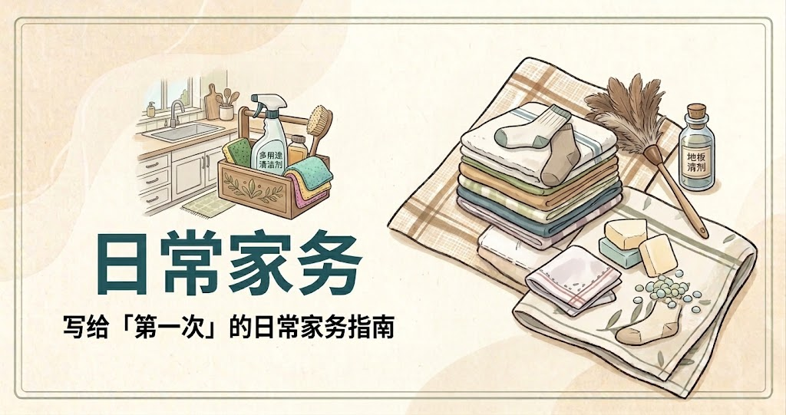

# 🌍 地球Online指南

> 从蒸米饭到坐高铁——写给「第一次」的全场景生活技能手册。

**在线阅读：https://eartholguide.com/**

🚧 项目持续更新中——欢迎提交 PR，补充攻略、修正错误、增加新任务。

## 这是什么

本项目是一份面向「地球服新手玩家」的开源攻略手册。
收录现实世界各种任务流程、基础技能、避坑指南、隐藏规则。

任何人可以提交PR，补充攻略、修正错误、增加新任务。

## 内容板块

|  |  |  |
| :---: | :---: | :---: |
|  |  |  |

**共 47 篇已上线**：🍚 饮食做饭 11 · 🚄 出行交通 10 · 🏠 租房搬家 7 · 🏥 就医问诊 4 · 🛒 购物防骗 5 · 🧺 日常家务 10

做饭板块刻意做「精简版」——追求进阶菜谱请移步 [HowToCook](https://github.com/Anduin2017/HowToCook)（102k★，我们致敬的同类前辈）。

## 参与

- 投稿与协作方式见 [contributing](https://eartholguide.com/contributing)
- 发现错误？[提交勘误](https://github.com/PensiveFei/earth-online-guide/issues/new?template=errata.yml)

## 免责声明

本站内容仅供参考，不构成医疗、法律或任何专业建议；涉及健康问题请及时就医，涉及法律问题请咨询专业人士。按文中步骤操作前，请先阅读[免责声明](https://eartholguide.com/disclaimer)。

## 许可证

本仓库内容采用 [CC BY-SA 4.0](LICENSE) 许可——转载需署名，并以相同方式共享。
